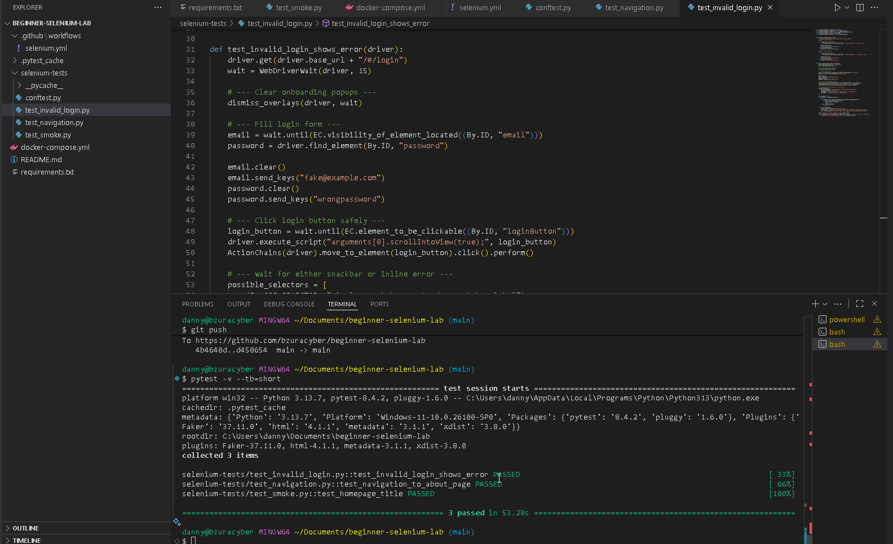

# 🧪 Selenium Lab – Automated Web Testing Environment

## 📖 Overview
This lab demonstrates how to set up and run automated browser tests using **Selenium** in a containerized environment. It’s designed to be:
- **Reproducible**: Works consistently across local and CI/CD environments.
- **Beginner‑friendly**: Clear steps for setup and execution.
- **Extensible**: Easy to add new test cases or integrate with pipelines.

The lab uses **Docker** and **Selenium Grid** to provide a scalable, isolated test environment. Example tests target [OWASP Juice Shop](https://owasp.org/www-project-juice-shop/) (or your chosen demo app), validating login flows, navigation, and UI elements.

---

## 🛠️ Features
- Local Selenium WebDriver setup (Chrome/Firefox).
- Example Python test suite using `pytest` + `selenium`.
- Configurable base URL for the app under test.
- Structured for easy extension into CI/CD later.

---

## 🖥️ Prerequisites & Installation

### 1. Clone the repo 
```bash
  git clone https://github.com/bzuracyber/beginner-selenium-lab.git
  cd selenium-lab
```

### 2. Start Selenium Grid + app 
```bash
  docker-compose up -d
```
### 3. Install Python Dependencies
- Use the provided `requirements.txt` file to install required packages such as:
  - `selenium`
  - `pytest`
  - `pytest-html` (optional for reporting)
    
```bash
  pip install -r requirements.txt
```

### 4. Run Tests

```bash
  pytest -v --tb=short
```

---

## ⚙️ Configuration
- **App URL**: Default is `http://localhost:<port>` where Juice Shop is running.
- **Browser selection**: Configurable via environment variable or fixture (e.g., Chrome vs. Firefox).
- **Test runner**: Uses `pytest` for structured, maintainable test execution.

---

## 📊 Example Test Output

- tests/test_login.py::test_valid_login PASSED
- tests/test_navigation.py::test_homepage_links PASSED
  
✅ All tests completed successfully!

<p align="center">
  
</p>

---

## 📚 Learning Goals
- Understand how Selenium interacts with a locally hosted web app.
- Practice writing maintainable UI tests.
- Gain experience debugging browser automation.
- Build a foundation for scaling tests into containerized or CI/CD environments.

---

## 🔮 Next Steps
- Add more test cases (e.g., form validation, error handling).
- Parameterize tests for multiple browsers.
- Extend to containerized Selenium Grid for parallel execution.
- Integrate with CI/CD workflows for automated regression testing.
